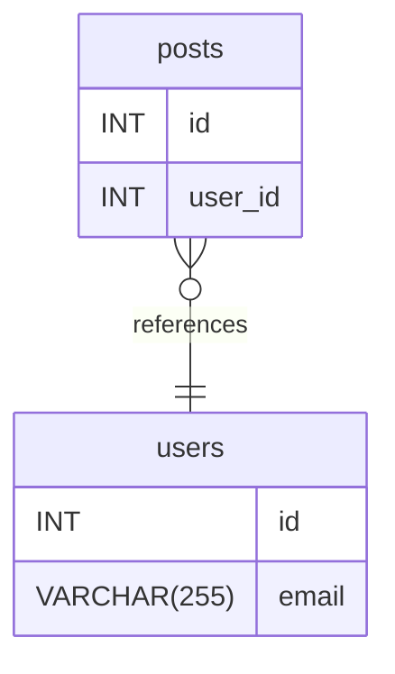

# Export service fixture documentation
## Summary

- [Introduction](#introduction)
- [Database Type](#database-type)
- [Table Structure](#table-structure)
	- [users](#users)
	- [posts](#posts)
- [Relationships](#relationships)
- [Database Diagram](#database-diagram)

## Introduction

## Database type

- **Database system:** MySQL
## Table structure

### users

| Name      | Type         | Settings                       | References | Note |
| --------- | ------------ | ------------------------------ | ---------- | ---- |
| **id**    | INT          | 🔑 PK, not null, autoincrement |            |      |
| **email** | VARCHAR(255) | not null, unique               |            |      | 

### posts

| Name        | Type | Settings                       | References     | Note |
| ----------- | ---- | ------------------------------ | -------------- | ---- |
| **id**      | INT  | 🔑 PK, not null, autoincrement |                |      |
| **user_id** | INT  | not null                       | fk_posts_users |      | 

## Relationships

- **posts to users**: many_to_one

## Database Diagram

